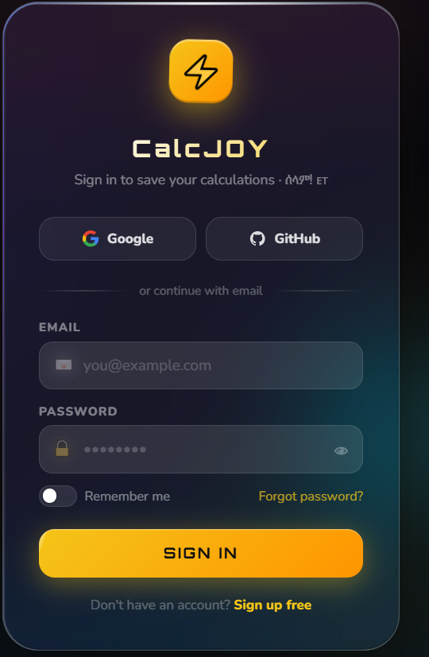
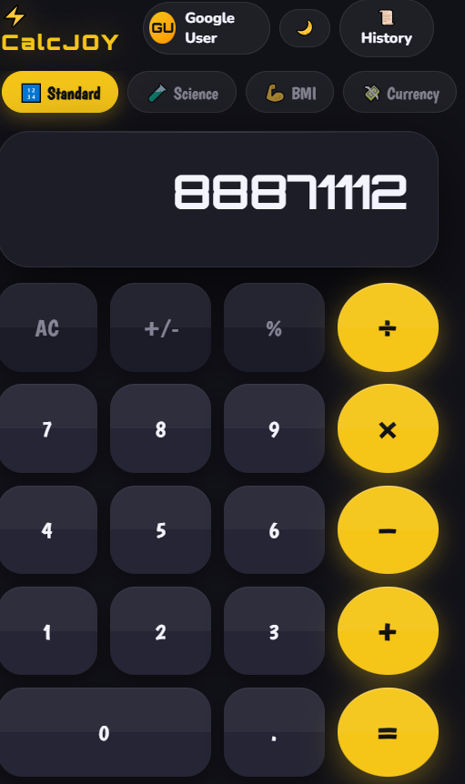
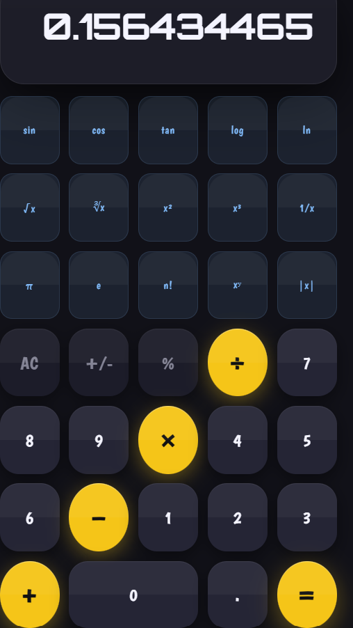
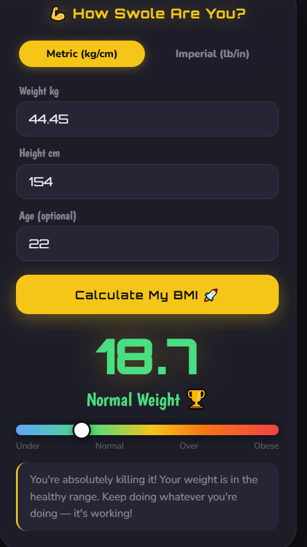
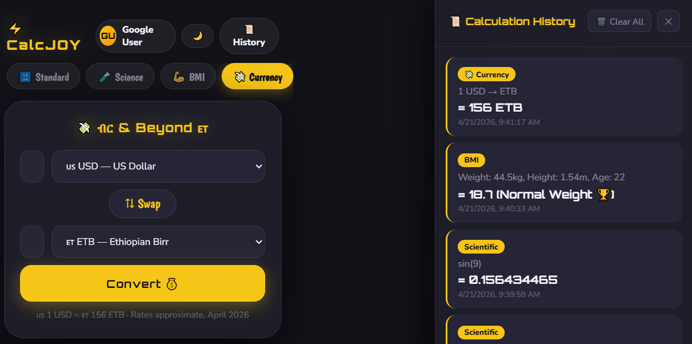
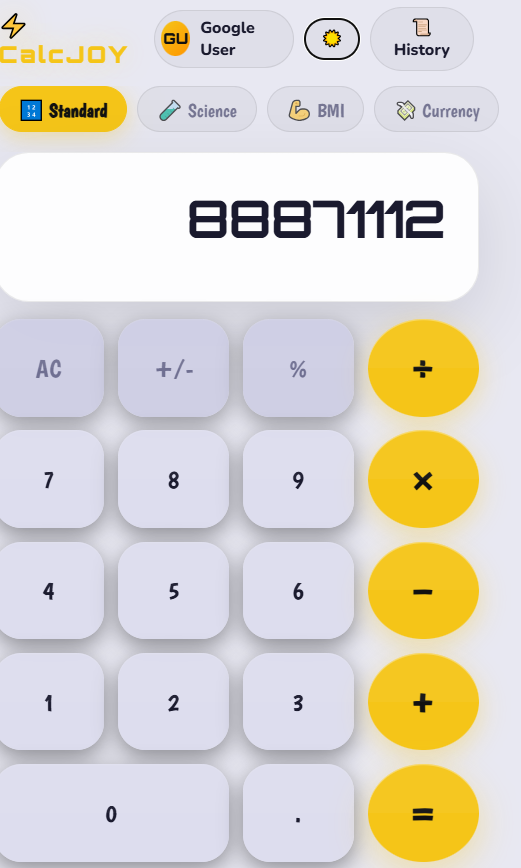

# ⚡ CalcJOY v1.0

> A hilariously powerful calculator web app — built for everyone, especially for you, Ethiopia 🇪🇹

🔗 **Live App → [calculeteria.vercel.app](https://calculeteria.vercel.app/)**

---

## 📸 Screenshots

<div align="center">


&nbsp;&nbsp;

&nbsp;&nbsp;


<br/><br/>


&nbsp;&nbsp;



</div>

---

## 🚀 How to Run

No installs. No build steps. No nonsense.

1. Clone or download this repo
2. Open `index.html` in any browser — or visit the live link above
3. That's it. You're calculating.

---

## ✨ Features

### 🔐 Liquid Glass Sign In
- iOS 26-style Liquid Glass auth modal with animated conic border, SVG liquid warp filter, morphing blobs, floating particles
- Sign up / Sign in with email & password (stored locally)
- One-click Google & GitHub demo login
- Password show/hide, remember me toggle, forgot password flow
- Session persists across reloads — user avatar badge in header

### 🔢 Standard Calculator
- Full arithmetic: +, −, ×, ÷, %, +/−
- Live preview result as you type
- Full keyboard support (numbers, operators, Enter, Backspace, Escape)

### 🧪 Scientific Calculator
- Trig: sin, cos, tan (degrees)
- Logarithms: log, ln
- Powers & roots: x², x³, xʸ, √x, ∛x
- Constants: π, e · Factorial n! · Absolute |x| · Inverse 1/x

### 💪 BMI Calculator
- Metric (kg/cm) and Imperial (lb/in) modes
- Animated BMI bar with sliding marker
- Categories with honest (and funny) health advice

### 💸 Currency Converter — Ethiopia First 🇪🇹
30 currencies — ETB is the default:

| Region | Currencies |
|--------|-----------|
| 🇪🇹 East Africa | ETB, KES, UGX, TZS, RWF, DJF, SOS, SDG |
| 🌍 Africa | EGP, NGN, GHS, ZAR, MAD, XOF, XAF |
| 🌐 Diaspora | AED 🇦🇪, SAR 🇸🇦 |
| 🌎 World | USD, EUR, GBP, CNY, JPY, INR, CAD, AUD, CHF, KRW, BRL, MXN, IDR, TRY |

Rates: 1 USD ≈ 156 ETB (April 2026 mid-market)

### 📐 Unit Converter
5 categories, 40+ units — Length, Weight, Temperature, Area, Speed

### 📜 Calculation History
- Every calculation auto-saved to localStorage
- Slide-out history panel with timestamps
- Clear all button

### 🌙 Dark / Light Theme
Toggle saved to localStorage — both modes look sharp

### 📱 PWA — Installable on Mobile
- Works offline via service worker cache
- Add to home screen on Android & iOS
- Install banner prompt

---

## 🗂️ File Structure

```
CalcJOY/
├── index.html          — App structure & all UI panels
├── style.css           — Main styles, themes, calculator UI
├── auth.css            — Liquid Glass sign-in modal styles & animations
├── app.js              — All logic: calc, BMI, currency, units, auth, history, PWA
├── manifest.json       — PWA manifest
├── sw.js               — Service worker (offline cache)
├── icons/              — PWA icons (192px, 512px)
├── screenshots/        — App screenshots for README
└── README.md           — You are here
```

---

## 🛠️ Tech Stack

| What | How |
|------|-----|
| Language | Vanilla HTML, CSS, JavaScript |
| Fonts | Google Fonts — Orbitron, Boogaloo, Nunito |
| Storage | localStorage (no backend needed) |
| Auth | Client-side only (demo mode) |
| Deployment | Vercel |
| Dependencies | Zero. None. Nada. |

---

## 🔮 Planned for v2

- [ ] Live exchange rates via free API
- [ ] Amharic (አማርኛ) language support
- [ ] Ethiopian calendar converter (Ge'ez ↔ Gregorian)
- [ ] Loan / mortgage calculator
- [ ] Tip calculator
- [ ] Export history as CSV

---

## 🇪🇹 Made with love for Ethiopia

ሰላም! This app was built with Ethiopian users in mind.
ETB is the default currency. All East African neighbors are represented.
More Ethiopia-specific features coming in v2.

---

*CalcJOY v1.0 — Zero dependencies. Pure web. All power.*
*Live at [calculeteria.vercel.app](https://calculeteria.vercel.app/)*
